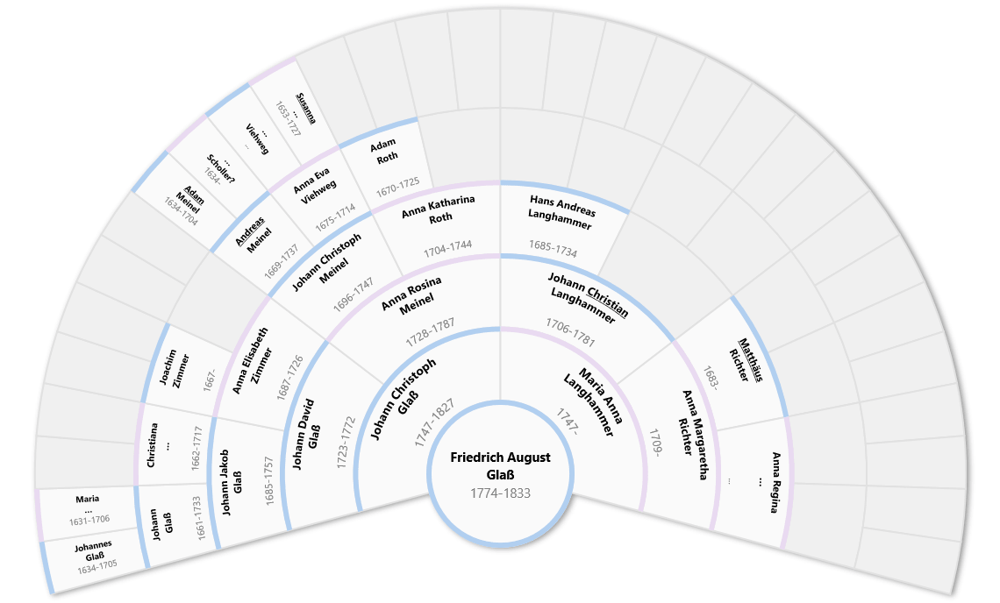
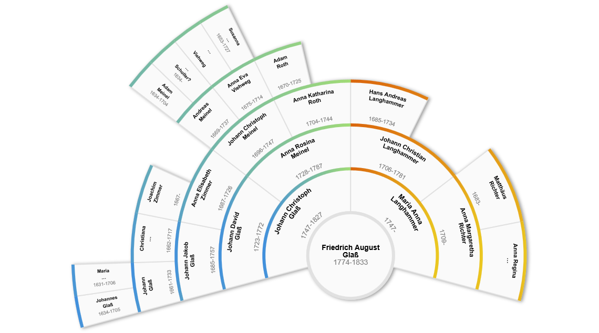
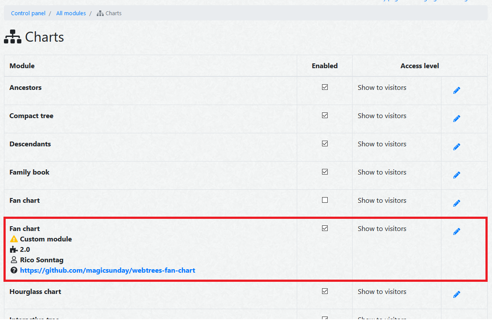

[](http://www.gnu.org/licenses/gpl-3.0)
[](https://scrutinizer-ci.com/g/magicsunday/ancestral-fan-chart/?branch=master)
[](https://codeclimate.com/github/magicsunday/ancestral-fan-chart)
[](https://codeclimate.com/github/magicsunday/ancestral-fan-chart/coverage)
[](https://codeclimate.com/github/magicsunday/ancestral-fan-chart)

# Ancestral fan chart
This modules provides an SVG ancestral fan chart for the [webtrees](https://www.webtrees.net) genealogy application.





## Installation
### Using Composer
To install using [composer](https://getcomposer.org/), just run the following command from the command line 
at the root directory of your webtrees installation.

``` 
composer require magicsunday/ancestral-fan-chart --update-no-dev
```

The module will automatically installed into the ``modules_v3`` directory of your webtrees installation.

To remove the module run:
```
composer remove magicsunday/ancestral-fan-chart --update-no-dev
```

### Using Git
If you are using ``git``, you could also clone the current master branch directly into your ``modules_v3`` directory 
by calling:

```
git clone https://github.com/magicsunday/ancestral-fan-chart.git modules_v3/ancestral-fan-chart
```

### Manual installation
To manually install the module, perform the following steps:

1. Download the [latest release](https://github.com/magicsunday/ancestral-fan-chart/releases/latest).
2. Upload the downloaded file to your web server.
3. Unzip the package into your ``modules_v3`` directory.
4. Rename the folder to ``ancestral-fan-chart``

## Enable module
Go to the control panel (admin section) of your installation and click on the ``Module administration`` link 
inside the ``Modules`` section. Enable the ``Ancestral fan chart`` module and save your settings.




## Usage
At the charts menu, you will find a new link called `Ancestral fan chart`.


## Development
To build/update the custom d3 version, run the following commands inside the ``/js/packages`` directory:

```
npm install
npm run prepare
```
