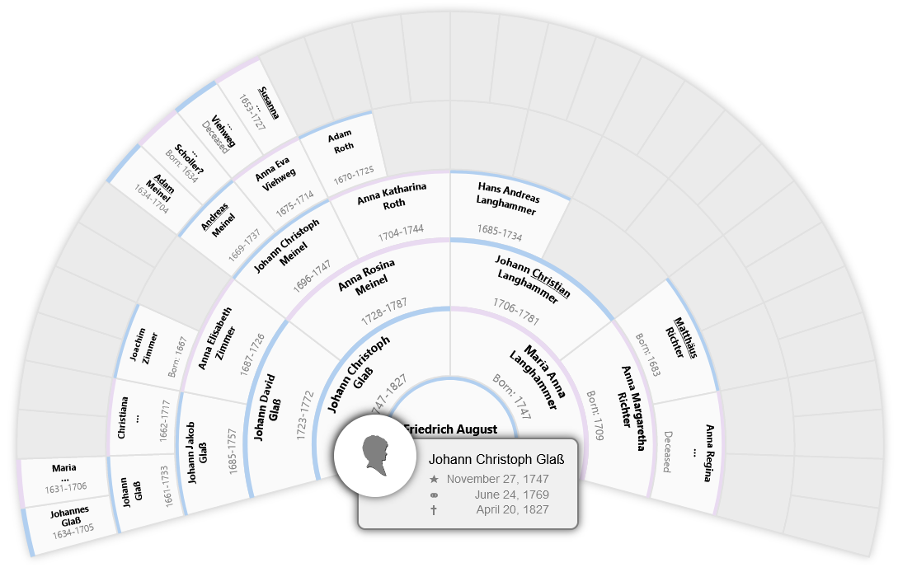

# Fan chart
This module provides an SVG ancestor fan chart for the [webtrees](https://www.webtrees.net) genealogy application.




## Installation
Requires webtrees 2.2.

### Using Composer
To install using [composer](https://getcomposer.org/), just run the following command from the command line 
at the root directory of your webtrees installation.

``` 
composer require magicsunday/webtrees-fan-chart:* --update-no-dev
```

The module will automatically install into the ``modules_v4`` directory of your webtrees installation.

To remove the module run:
```
composer remove magicsunday/webtrees-fan-chart --update-no-dev
```

### Using Git
If you are using ``git``, you could also clone the current master branch directly into your ``modules_v4`` directory 
by calling:

```
git clone https://github.com/magicsunday/webtrees-fan-chart.git modules_v4/webtrees-fan-chart
```

### Manual installation
To manually install the module, perform the following steps:

1. Download the [latest release](https://github.com/magicsunday/webtrees-fan-chart/releases/latest).
2. Upload the downloaded file to your web server.
3. Unzip the package into your ``modules_v4`` directory.
4. Rename the folder to ``webtrees-fan-chart``

## Enable module
Go to the control panel (admin section) of your installation and scroll down to the ``Modules`` section. Click 
on ``Charts`` (in subsection Genealogy). Enable the ``Fan chart`` custom module (optionally disable the original
installed fan chart module) and save your settings.


## Usage
At the charts' menu, you will find a new link called `Fan chart`. Use the provided configuration options
to adjust the layout of the charts according to your needs.

Right clicking on an individual opens an tooltip providing more detailed information of the current individual.


## Development
To build/update the javascript, run the following commands:

```
nvm install node
npm install --unsafe-perm --save-dev
npm run prepare
```

### Run tests
```
composer update
vendor/bin/phpstan analyse --xdebug --memory-limit=-1 -c phpstan.neon
vendor/bin/phpcs src/ --standard=PSR12
```
