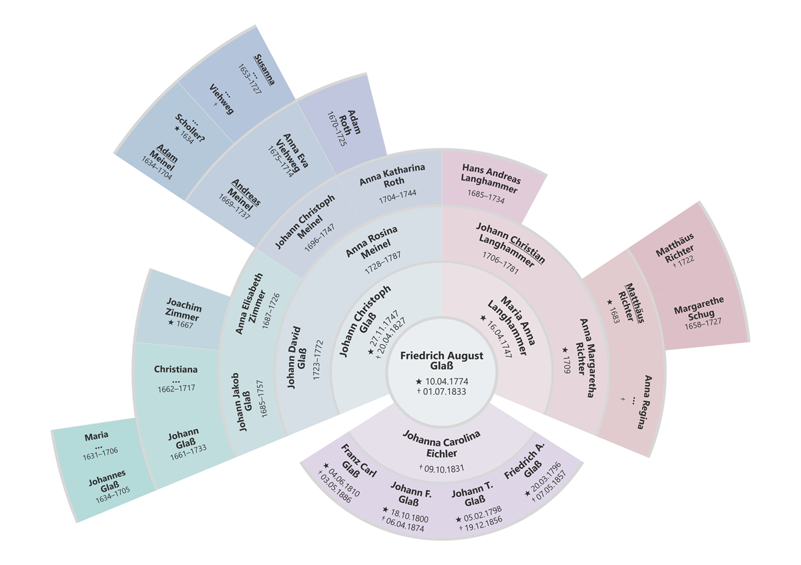
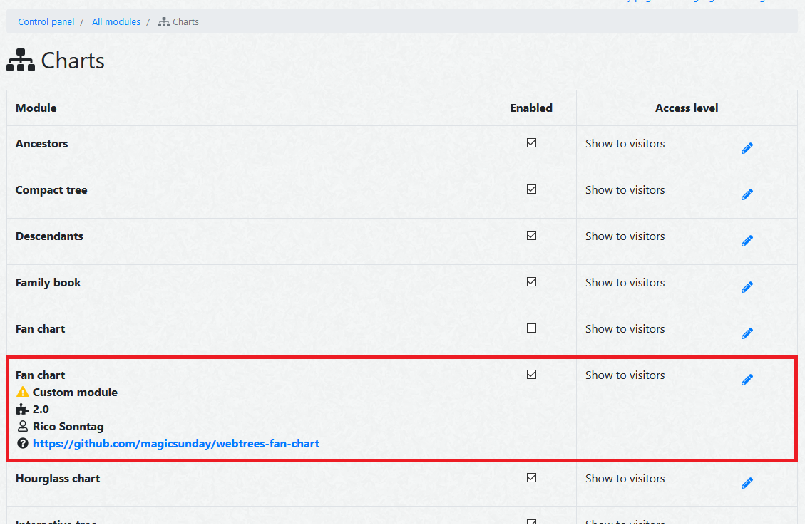

[](https://github.com/magicsunday/webtrees-fan-chart/releases/latest)
[](https://github.com/magicsunday/webtrees-fan-chart/blob/main/LICENSE)
[](https://github.com/magicsunday/webtrees-fan-chart/actions/workflows/ci.yml)


<!-- TOC -->
* [Fan chart](#fan-chart)
  * [Installation](#installation)
    * [Manual installation](#manual-installation)
    * [Using Composer](#using-composer)
    * [Using Git](#using-git)
  * [Update](#update)
  * [Configuration](#configuration)
  * [Usage](#usage)
  * [Troubleshooting](#troubleshooting)
  * [Development](#development)
<!-- TOC -->


# Fan chart
This module provides an interactive SVG ancestor fan chart for the [webtrees](https://www.webtrees.net) genealogy application.
Click on any ancestor to re-center the chart on that person. Right-click to open a tooltip with detailed
dates, places, and images.




## Installation
Requires **webtrees 2.2** and **PHP 8.3** or later.

### Manual installation

> [!IMPORTANT]
> **Download the right `.zip` file.** Each [GitHub release](https://github.com/magicsunday/webtrees-fan-chart/releases/latest) page lists two kinds of archive:
>
> - ✅ **`webtrees-fan-chart.zip`** — listed under **Assets** at the bottom of the release. This is the install-ready archive: it bundles the required `vendor/` dependencies (such as `webtrees-module-base`).
> - ❌ **"Source code (zip)" / `webtrees-fan-chart-<version>.zip`** — auto-generated by GitHub from the tag. This is the raw source *without* bundled dependencies. Uploading it to `modules_v4/` will fail with `Interface "MagicSunday\Webtrees\ModuleBase\…" not found` (or `ModuleAssetUrlInterface not found`).
>
> **Always pick the asset zip, never "Source code (zip)".**

> [!IMPORTANT]
> **If a previous version of this module is already installed:** delete the entire `modules_v4/webtrees-fan-chart` folder *before* extracting the new ZIP. Extracting on top of an existing folder leaves stale files behind that can clash with the new release — a common cause of `Interface … not found` errors right after an update.

1. Open the [latest release](https://github.com/magicsunday/webtrees-fan-chart/releases/latest) page.
2. Under **Assets**, download `webtrees-fan-chart.zip`.
3. Upload the `.zip` file to your web server.
4. Unzip the package into your `modules_v4` directory.
5. Rename the folder to `webtrees-fan-chart`.

You should now see a `modules_v4/webtrees-fan-chart` directory containing the module files.

### Using Composer
Run the following command from the root of your webtrees installation:

```shell
composer require magicsunday/webtrees-fan-chart --update-no-dev
```

The module will automatically install into the `modules_v4` directory.

To remove the module:
```shell
composer remove magicsunday/webtrees-fan-chart --update-no-dev
```

If you are using the development version of webtrees (`main` branch):
```shell
composer require magicsunday/webtrees-fan-chart:dev-main --update-no-dev
```

### Using Git
Clone the repository directly into your `modules_v4` directory:

```shell
git clone https://github.com/magicsunday/webtrees-fan-chart.git modules_v4/webtrees-fan-chart
```


## Update
To update to the latest version:

- **Manual installation**: From the [latest release](https://github.com/magicsunday/webtrees-fan-chart/releases/latest) **Assets** section, download `webtrees-fan-chart.zip` (not "Source code (zip)"), delete the old `modules_v4/webtrees-fan-chart` folder, and extract the new one.
- **Composer**: Run `composer update magicsunday/webtrees-fan-chart --update-no-dev`.
- **Git**: Run `git pull` inside the `modules_v4/webtrees-fan-chart` directory.


## Configuration
1. Go to the **Control Panel** (admin section) of your webtrees installation.
2. Scroll down to the **Modules** section and click on **Charts** (under Genealogy).
3. Enable the **Fan chart** module. Optionally disable the built-in fan chart to avoid confusion.
4. Click **Save**.




## Usage
Open the **Charts** menu on any individual page and select **Fan chart**.

The form at the top lets you choose the starting person, fan size (180-360 degrees), and number of
generations (2-10).

Click **Show more options** to access additional settings:

| Option | Description |
|--------|-------------|
| **Display mode** | Choose between "Show names and images", "Show names only", or "Show images only". Images are only shown if the arc segment is wide enough. |
| **Show descendants** | Shows partners and children as arcs below the ancestor section. The fan size is limited to 180-270 degrees when enabled. |
| **Hide empty segments** | Hides chart segments for missing ancestors. |
| **Show places** | Displays birth and death places in the chart arcs where space allows. For descendants with many children, places are automatically suppressed. Choose the level of detail (full name or lowest 1-3 hierarchy levels). |
| **Show parent marriage dates** | Displays marriage dates in a narrow arc between each pair of parent arcs. When descendants are enabled, also shows the marriage date between the central person and their partners. |
| **Show family colors** | Colors arcs by family branch. Paternal and maternal base colors are configurable via color pickers. |
| **Birth and death date precision** | Show full birth and death dates (DD.MM.YYYY) for early generations. Outer generations use a compact year-only format. Marriage dates switch to year-only from generation 7 and are hidden from generation 9. Descendants with narrow arcs automatically use a compact format. |
| **Number of inner levels** | Controls how many generations use the wider inner-arc layout with text along the arc path. |
| **Font size** | Scales the text size (50-150%). |

**Interacting with the chart:**

| Action | Effect |
|--------|--------|
| Click on a person | Re-centers the chart on that person |
| Right-click on a person | Opens a detailed tooltip with dates, places, and image |
| Ctrl + scroll | Zoom in/out |
| Click and drag | Move the chart |
| Click center button | Reset view to center |
| Fullscreen button | Toggle fullscreen mode |
| PNG / SVG buttons | Export the chart as an image file |


## Troubleshooting

**Fatal error after a manual installation or update: `Interface "MagicSunday\Webtrees\ModuleBase\…" not found` (or `ModuleAssetUrlInterface not found`)**
- You probably downloaded the GitHub-generated **"Source code (zip)"** instead of the install-ready asset **`webtrees-fan-chart.zip`**. The asset bundles the required `vendor/` dependencies; the source zip does not. Open the [latest release](https://github.com/magicsunday/webtrees-fan-chart/releases/latest), scroll to **Assets**, download `webtrees-fan-chart.zip`, and re-extract.
- If you used the asset zip, make sure you **deleted the previous `modules_v4/webtrees-fan-chart` folder before extracting**. Stale files from an older version can shadow the new bundled vendor code and produce the same error.

**The chart does not appear / shows an error**
- Make sure the module is enabled in the Control Panel under Modules > Charts.
- Check that your PHP version is 8.3 or later.
- Clear your browser cache and reload the page.

**Images are not displayed**
- Ensure "Show highlight images" is enabled in the tree preferences (Control Panel > Family trees > Preferences).
- Verify that media files are uploaded and linked to individuals.

**Places are not shown**
- Enable "Show places" in the chart options (under "Show more options").
- Make sure the individuals have PLAC fields in their GEDCOM records.


## Development
This section is for developers who want to contribute to the module.

### Building JavaScript
Using Docker (no local Node.js required):
```shell
make install
make build
```

Using local Node.js:
```shell
npm install
npm run prepare
```

### Running tests
```shell
# JavaScript tests
npm test

# Full PHP + JS quality check
composer update
composer ci:test
```
